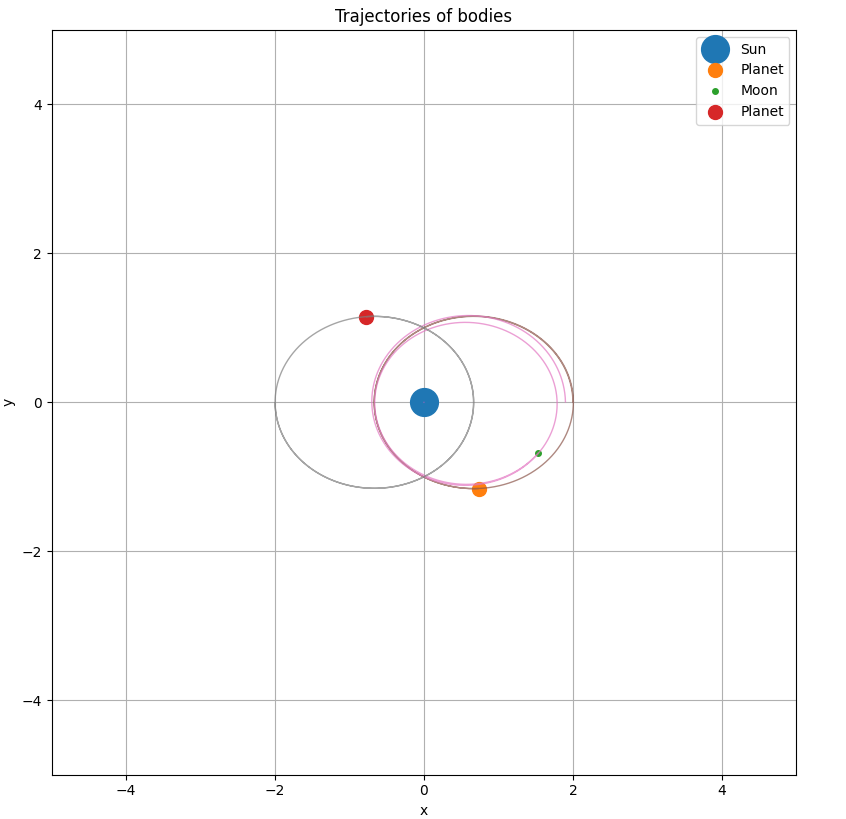

# Usage
Add bodies in `main()`. Then run with either -s or -a flags for either static or animated outputs (or both).

There are -i and -t flags for the number or increments per second and the simulation time respectively

# Example Output
